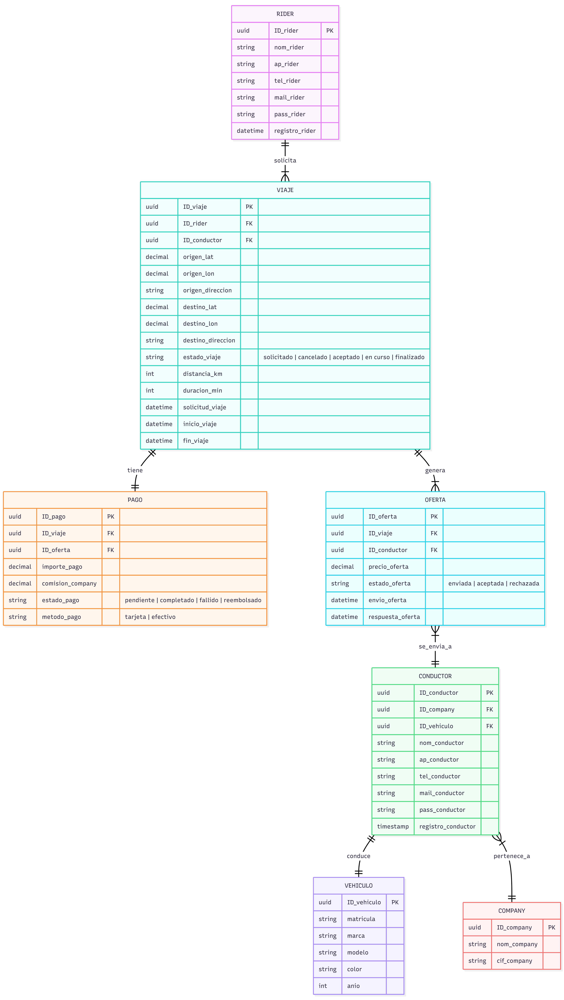

# Descripción
Para la práctica de la asignatura Bases de Datos Avanzadas se ha diseñado e implementado la base de datos de una plataforma de ride-hailing. En este sistema, un rider solicita un viaje que es ofertado a varios conductores. Estos pueden aceptarlo o rechazarlo, de modo que el primer conductor que lo acepte queda asignado al viaje y recibe el pago correspondiente una vez finalizado.

Nuestro modelo se articula en torno a siete entidades principales, cada una con sus correspondientes claves y atributos. A lo largo del presente archivo se explicarán dichas entidades, así como las relaciones existentes entre ellas y los criterios seguidos para su diseño.

# Supuestos para el diseño
En primer lugar, se han definido las relaciones del modelo entidad-relación a partir de una serie de supuestos, necesarios para comprender las decisiones adoptadas en el diseño:

1. Relación CONDUCTOR-VEHÍCULO  
    Dado que el enunciado no especifica si un conductor puede utilizar varios vehículos, se ha optado por asumir que cada conductor conduce siempre un único vehículo. Por ello, esta relación es una relación 1:1.

2. Relación VIAJE-PAGO  
    Se ha asumido que cada viaje genera un único pago, realizado una vez finalizado el trayecto. En consecuencia, la relación entre VIAJE y PAGO se ha planteado como 1:1.

3. Variable geolocalización  
    En la entidad VIAJE se almacenan tanto las coordenadas geográficas del origen y del destino como la dirección asociada a cada punto. De este modo, el usuario indica la ubicación deseada sin necesidad de buscar su latitud y longitud.

4. Clave foránea de VIAJE  
    La entidad VIAJE incorpora una clave foránea correspondiente al conductor asignado. Esta clave permanece vacía mientras el viaje se encuentra solicitado y pasa a completarse en el momento en que una de las ofertas es aceptada por un conductor. De este modo, el viaje queda vinculado al conductor que finalmente lo realizará.

# Modelo Entidad-Relación
A continuación, se presenta el MER resultante, realizado mediante la herramienta "Mermaid", recomendada en el enunciado proporcionado. 

# Entidades principales
